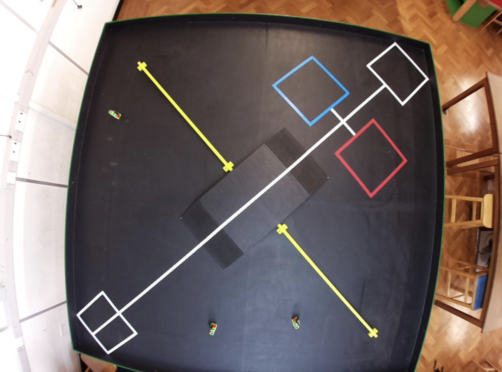

# idp206
## Computer Vision for IDP

The content of this package is taken from my Intergrated Design Project in University of Cambridge. 

## Features

- Establish connections to IDP cameras using ssh tunneling
- Download frames used for camera calibration
- Support charUco and chessboard camera calibartions 
- Load and save previous camera calibration results
- Show heatmap of image points used in camera calibratio
- Detect dummy image points

## License

MIT

## Images

